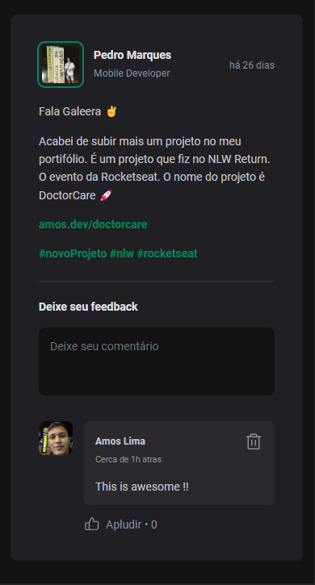
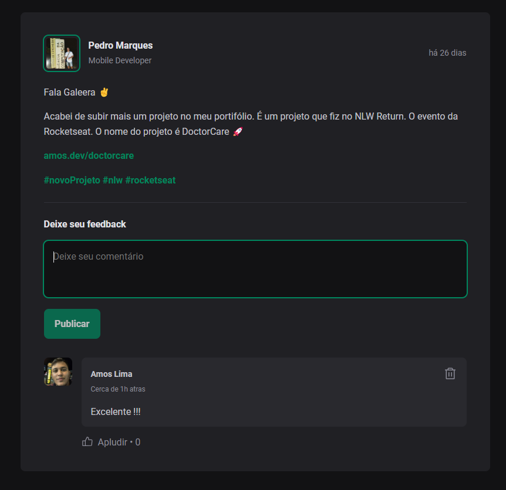

## Ignite Feed
&nbsp;

Durante este desafio, utilizamos os conceitos básicos do React desenvolvendo do zero uma mídia social simples onde você pode comentar, deletar e aplaudir (botão "Aplaudir") para interagir no aplicativo!

  
  

  
  

### 🛠️ Nesse projeto foi utilizado

* Vite
* CSS Modules
* Javascript
* ---Typescript---
* React

 

## 🚧 Layout

## :memo: Licença

Esse projeto está sob a licença MIT. Veja o arquivo [LICENSE](.github/LICENSE) para mais detalhes.

---

&nbsp;

